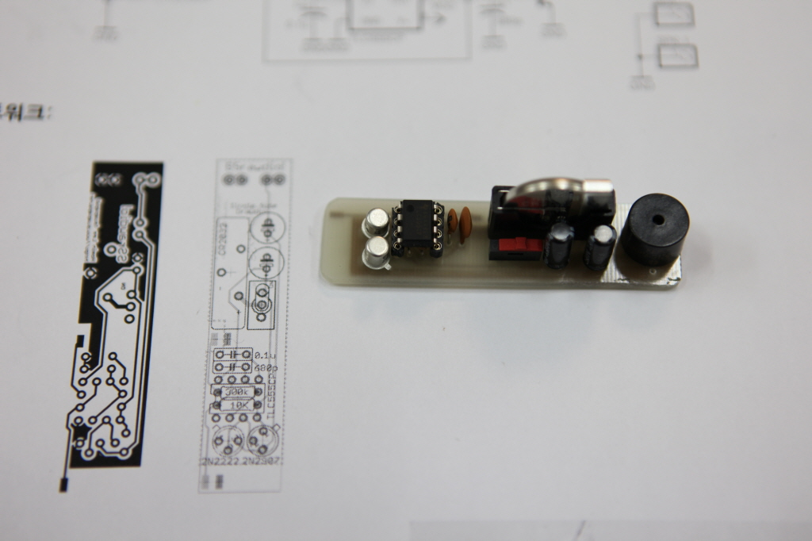

# **순돌이 아빠는 팅커러**


2023년 5월

**이 호 민**

---

## 발표자 소개

* 무난히? 남고 → 공대→ 군대 테크트리를 탄 공돌이
* 소프트웨어 엔지니어가 직업
* [한글시계](http://www.youtube.com/watch?v=ApymC7qAVTI) 창시자

---

## 팅커러


> 손으로 실험하고, 만들고, 수리하는 것을 즐기는 사람 <!--fit-->

❌ ~~Thinker~~
✅ Tinkerer

---

## 역사상 유명한 Tinkerer의 예

* 레오나르도 다 빈치
* 토마스 에디슨
* 스티브 잡스

---

# 발표 내용

---

## 발표자의 Tinkering 예시

- ESC pedal
- SingleSide Drawdio
- [한글시계](https://github.com/suapapa/HangulClock)
- [ArcadeDeck](https://github.com/suapapa/ArcadeDeck)

---

## 소개할 손재주 & 도구

- PCB 에칭
- Arduino (MCU + 코딩)
- 아크릴 레이져 커팅
- LibreCAD, OpenSCAD

---

# ESC pedal

---


> 발로 밟는 ESC 키

- ESC키는 개발자용 에디터인 
Vi에서 매우 자주 사용하는 키
- 키 까지의 손가락 거리가 멀었는데
발로 밟으니 편함

---


오늘쪽의 기성품에서 영감을 얻음

- 엔터키 말고 ESC키가 필요함
- 발로 밟고 싶음

---

# 창조?

> 하늘 아래 새로운 것은 없다

- 더 싸게
- 더 좋게
- 또는 조금 다르게

---

## 시제품(프로토타입) 만들기

재료
- 미싱페달
- 아두이노*
- 오디오잭

---


---

## 이러시는 이유가 있을거 아니에요

- 파는게 내가 원하는 것과 조금 다름 
- 누가 대신 만들어 주지도 않음
- 내가 할 수 있을 것 같으니까!

---

## 아두이노?


> Arduino는 사용하기 쉬운 하드웨어 및 소프트웨어를 기반으로 하는 오픈 소스 전자 플랫폼입니다.

- 여기선, 여러 아두이노 중
 USB기능이 있는 
 [Arduino Leonardo](https://docs.arduino.cc/hardware/leonardo) 사용

---


```cpp
#include <Keyboard.h>

#define PIN_PEDAL 8
char lastPress = 0;

void setup() {
  pinMode(PIN_PEDAL, INPUT_PULLUP);

  Keyboard.begin();
}

void loop() {
  if (digitalRead(PIN_PEDAL) == HIGH) {
    if (lastPress == 1) {
      lastPress = 0;
      Keyboard.releaseAll();
    }
  } else {
    if (lastPress == 0) {
      lastPress = 1;
      Keyboard.press(KEY_ESC);
    }
  }
  delay(100);
}
```

---


# SSRawdio

---

> 연필로 그려서
연주하는 악기


Single Side dRawdio:
원본 [Drawdio](https://drawdio.com/)의 리믹스

---

## DIY PCB

* 토너전사 기법을 사용해
에폭시 동판에 PCB 인쇄
* 에칭용액으로 마스킹 되지 않은 동판을 용해


---


---


---



---

## 획득한 기술


- 전자회로 → 라우팅
  - SW: [KiCad EDA](https://www.kicad.org/) 추천
- DIY PCB 제조
  - 양면 PCB는 거버파일(아트워크의 PDF)을
  추출해 주문제작

---

# ArcadeDeck

---


> 아케이드 버튼을
사용한 블루투스 
단축키 키보드
* [DeepDeck](https://deepdeck.co/)에서 영향받음
* 남는 부품들, 아크릴레이져컷팅, 3D프린팅을 사용해 완성

---


---


---


---

## 획득한 기술

- 아크릴 레이져 컷팅
  - 2D 캐드, [LibreCAD](https://librecad.org/) 추천
  - 네이버 스토어에서 아크릴 가공, 재단 검색하여 재단 주문
- 3D 모델링 및 출력
  - 3D 캐드, [OpenSCAD](https://openscad.org/) 사용
  - 가정에서 Prusa i3MK3 을 사용해 출력
- 손 땜 (인두질)
  - 점퍼선을 사용하면 연결이 조금 편해짐

---

## SW 개발환경

- MCU: ESP32
  - 아두이노만큼 저렴하면서 간단한 Wifi & BT가 가능한 작은 컴퓨터(MCU)
  - ESP32도 아두이노 개발환경(IDE)를 사용해 개발할 수 있지만
이 프로젝트에서는, 해보고 싶어서, [ESP-IDF](https://docs.espressif.com/projects/esp-idf/en/latest/esp32/index.html)를 사용
  - ESP-IDF는 좀 더 진지한? SW개발 환경. 편집기를 제공하지 않음
  - 소스코드 편집기로 [VSCode](https://code.visualstudio.com/)를 추천

---

# 한글시계

---


> 5x5 한글 조합의
단어 시계
(word clock)
* [A Word Clock by drj113](https://www.instructables.com/A-Word-Clock/)
에게서 영감을 받음

---


---


---

## 개선
> **Aprox. 15 years later**
- 시간이 자꾸 틀어져서 불편함.
  - RTC라는 칩(IC)의 한계

---

## 아두이노 → SBC*
- 인터넷을 통해 시간을
자동으로 맞출 수 있게 됨
- C++ → Go 
개발환경 변경으로 인한
작업 환경 개선


---


---

## SBC?


> Single Board Computer

- 손바닥 정도 크기의 컴퓨터
- 라즈베리파이(RaspberryPi)가 대표적

---

## 비용

- 에폭시동판
- 나무재단
- 토너전사용지
- 에칭용액
- LED, LED 드라이버등의 전자부품
- ~~아두이노~~ OrangePi(라즈베리파이 변종)
- 만드는데 든 비용은 약 20만원 가량으로 추정
(시행착오에 들어간 시간과 인건비 제외)

---

## 상품화 되어 판매중


* [원목한글시계 한시](https://ohou.se/productions/460364/selling)
* 68,000원!

---


# 오늘의 교훈

- **왠만하면 사서 쓰는게 낫다**

---

# 진짜 교훈

다음의 가치는 측정불가:
* 세상에 하나밖에 없는 물건을 만들어 가질 수 있음
* 만드는 과정의 즐거움
* 범용적인 문제 해결 능력 향상
  - 문제 ~~생성~~ 발견 능력 포함

---

## 감사의 인사


- 발표자의 홈페이지: 
https://homin.dev
